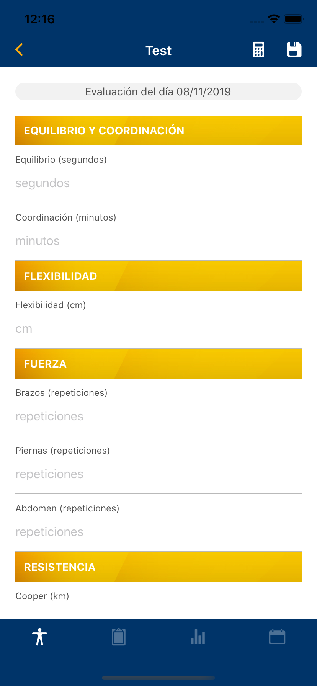
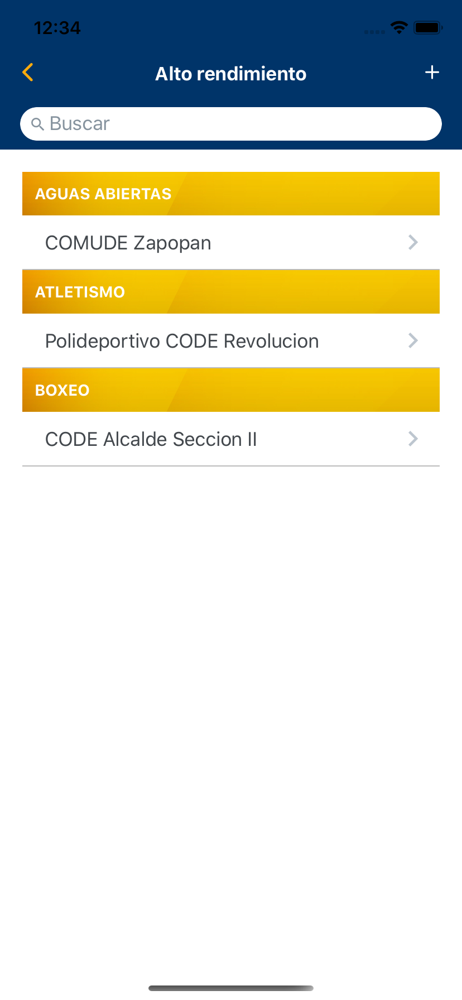
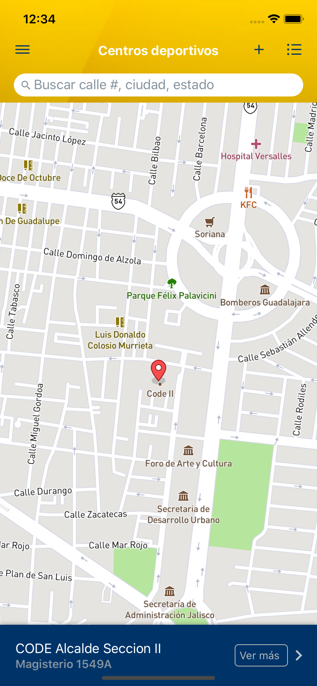

# NED CODE

Nutrición y entrenamiento en Red (NED) es una aplicación desarrollada para Consejo Estatal para el Fomento Deportivo (CODE) de Jalisco, México. Desarrollada con react native, php y mysql.





## Requerimientos

*   [React Native 0.60](https://facebook.github.io/react-native/docs/getting-started)
*   PHP 7.3
*   MYSQL
*   Xcode
*   Android studio


## Instalación

```bash
git clone https://github.com/aodevil/ned
cd ned
npm install
```

## Configuración

Para montar la base de datos y hacer las solicitudes http es necesario un dominio y certificado de seguridad.

> Usar el archivo *.sql* ubicado en la raíz del proyecto. Conservar los datos precargados. Son importantes para el funcionamiento inicial de la aplicación. El usuario base es `COORD0` y la contraseña `123`.

Colocar el contenido de la carpeta *backend* en un servidor.

#####   Indicar valores personalizados en algunas variables:

*/backend/api/model/Mailer.php*

```php
    private static $mailer_username_name = "...";
    private static $mailer_server = "...";
    private static $mailer_username = "...";
    private static $mailer_password = "...";
    private static $mailer_port = 000;
    private static $mailer_transport_protocol = "...";
```

*/backend/api/connection.php*

```php
    $connection = new PDO("mysql:host=localhost;dbname=...;charset=utf8", "user", "pass");
```

*/src/services/post.js*

```js
   const controller = "https://domain.com/controller.php"; 
```

*/src/services/constants.js*

```js
   export const MBXTOKEN = "<token de mapbox -  se debe crear una cuenta>"; 
```

##### Configuración adicional para iOS

```bash
cd ned
pod install
cd ..
```

##### Configuración adicional para Android

```bash
react-native link react-native-vector-icons
```

> Este paso podría ocasionar conflictos con iOS. Después de realizarlo, abrir el archivo *nex.xcodeproj* localizado dentro de la carpeta *ios*. Se abriá Xcode. En Xcode ir al panel de navegación ubicado a la izquierda, expandir Resources y eliminar los archivos .ttf

##### Ejecutar la aplicación

```bash
react-native run-ios
```

```bash
react-native run-android
```


## License

[Mozilla Public License Version 2.0](LICENSE.txt)
